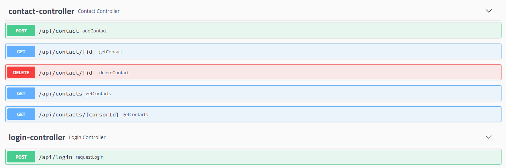
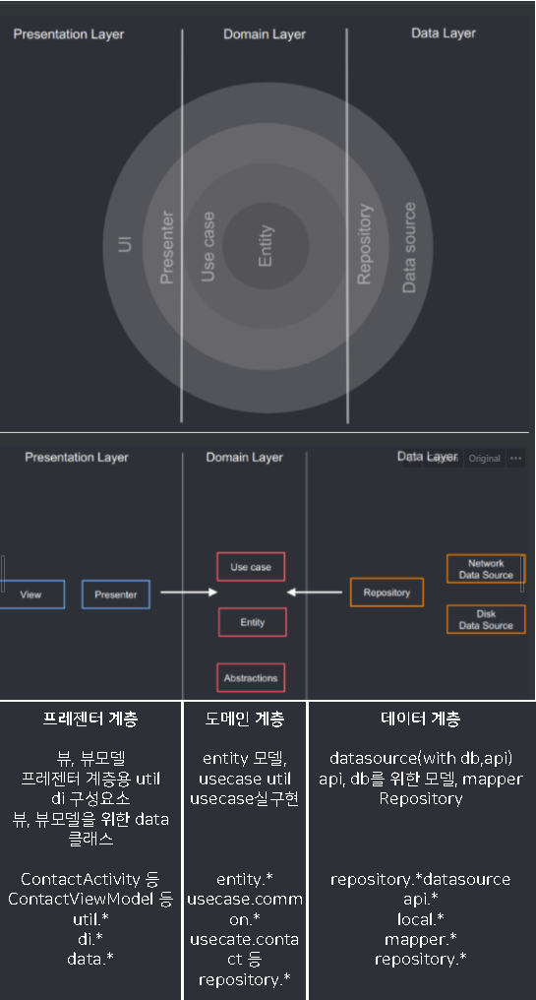

 - # seoft-android-clean-architecture

   ### 세부 내용 블로그에 기술 :

   https://blog.seoft.co.kr/80

    

   ### 요구사항

    - ID 와 페스워드를 서버에 검증받은 후 다음 페이지로 진입
    - 연락처 데이터를 가져와 리스팅 (페이징 가능, 리플래시 가능)
    - 서버 요청으로 연락처 데이터 상세 조회 (사실 연락처 데이터를 다 가지고 있어서 서버요청 안해도되는데.. id로 쿼리하는 막연한 예시로..)
    - 연락처 데이터를 추가 혹은 삭제
    - 연락처 데이터의 즐겨찾기 기능(로컬 DB연동 예시를 위한..)

   

    

   ### ./android-clean-architecture
   android-clean-architecture는 위의 요구사항을 만족시는 클린아키텍쳐로 구성된 안드로이드 프로젝트

    

   ### ./example-server-for-clean-architecture
   안드로이드 데모앱이 연동되는 api 서버이며 api들은 다음과 같이 구성

   

    

   ### 해당 프로젝트 클린아키텍쳐 매칭 내용
   

    

   ### 주요 사용 라이브러리
    - rxjava
    - viewmodel
    - livedata
    - room
    - koin